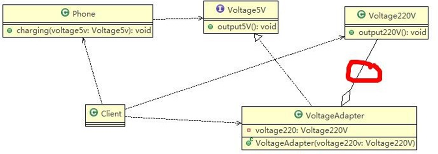

```html
适配器模式:
1.适配器模式（Adapter Pattern）将某个类的接口转换成客户端期望的另一个接口表示，主要目的是兼容性，让原本因接口不匹配不能一起工作的两个类可以协同工作。

2.适配器模式属于结构型模式,其别名为包装器(Wrapper)
3.适配器模式主要分为三类:
. 类适配器模式
. 对象适配器模式
. 接口适配器模式
4.形象比方: typec转3.5mm耳机转接口，手机充电器(220v转5v的电压转换模块)
5.工作原理:
. 适配器模式就是将一个类的接口转换成为另一个接口，让原本不兼容的类可以兼容
. 从用户的角度看不到被适配者，是解耦的
. ！！！ 用户调用适配器转换出来的目标接口方法，适配器调用被适配者的相关接口方法
. 达到用户和目标接口交互的效果

6.角色
. 被适配者 src
. 适配器   adapter
. 目标输出 dst

类适配器:
1. 介绍:Adapter类通过继承src类，实现dst类接口，完成从src->dst的适配
2. 假设220v 为adapter，电压转换器为src，5v为dst
3. 注意事项:
. java是单继承机制，所以类适配器需要继承src类是缺点，存在局限性
. src类中的方法在Adapter中都会暴露出来，增加了使用成本
. 由于其继承了src类，所以adapter可以根据需要重写src类的方法，使得adapter的灵活性增强

对象适配器:
1. 介绍: 思路和类适配器相似，只不过将Adapter类修改，不是继承src，而是持有src的实例
2. 根据"合成复用原则"，在系统中尽量使用关联关系来替代继承关系
3. 对象适配器是适配器中常用的一种
4. 注意事项:
1.对象适配器和类适配器其实算是同一种思想，只不过实现的方式不同。根据合成复用原则，使用组合代替继承，所以它解决了类适配器的继承问题
2.成本低，更灵活

接口适配器模式:
1. 当不需要全部实现接口提供的方法时，可以先设计一个抽象类实现接口，并为该接口中每个方法提供默认实现（空方法）
2. 那么该抽象类的子类可有选择地覆盖父类的某些方法提供需求(接口中提供的模板)
3. 适用于一个接口不想使用其所有方法的情况

适配器模式的注意事项和细节:
1. 适配器模式有三种，根据src是以怎样的形式给Adapter(在Adapter中的形式)
类适配器: 在Adapter中，将src当做类继承
对象适配器: 在Adapter中，将src作为对象，持有
接口适配器: 在Adapter中，将src作为接口，实现

2.Adapter最大的作用是将原本不兼容的接口融合在一起工作 => 多个接口协同工作

用适配器 代替 if else???

A ->B 但是不能直接用
A -> adapter ->B
当你有动机修改一个已经投入生产的接口，这时候就可以考虑试用适配器模式。适配器模式是用于解决接口不兼容问题有效方法

```
```java
package adapter.objectadapter;

//适配器类
public class VoltageAdapter implements IVoltage5V {

    private Voltage220V voltage220V;  //关联关系 -- 聚合关系

    //通过构造器，传入一个Voltage220V实例
    public VoltageAdapter(Voltage220V voltage220V) {
        this.voltage220V = voltage220V;
    }

    @Override
    public int output5V() {
        int dst = 0;
        if (voltage220V != null){
            int src = voltage220V.output220V();//获取220电压
            System.out.println("使用对象适配器进行适配");
            dst = src / 44;
            System.out.println("适配完成，输出电压为=" + dst);
        }
        return dst;
    }
}

```

