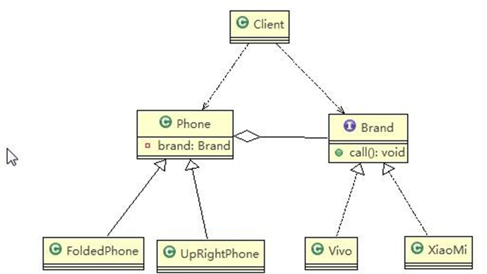

```html
第 10    章桥接模式
10.1    手机操作问题
现在对【不同手机类型】的【不同品牌】实现操作编程(比如:开机、关机、上网，打电话等)，如图

10.4	桥接模式(Bridge)-基本介绍
基本介绍
1)	桥接模式(Bridge 模式)是指：将实现与抽象放在两个不同的类层次中，使两个层次可以独立改变。
2)	是一种结构型设计模式
3)	Bridge 模式基于类的最小设计原则，通过使用封装、聚合及继承等行为让不同的类承担不同的职责。它的主要特点是把抽象(Abstraction)与行为实现(Implementation)分离开来，从而可以保持各部分的独立性以及应对他们的功能扩展

10.7	桥接模式在 JDBC 的源码剖析
桥接模式在 JDBC 的源码剖析
1)	Jdbc 的 Driver 接口，如果从桥接模式来看，Driver 就是一个接口，下面可以有 MySQL 的 Driver，Oracle 的
Driver，这些就可以当做实现接口类
2)	代码分析+Debug 源码
10.8	桥接模式的注意事项和细节

1)	实现了抽象和实现部分的分离，从而极大的提供了系统的灵活性，让抽象部分和实现部分独立开来，这有助于系统进行分层设计，从而产生更好的结构化系统。
2)	对于系统的高层部分，只需要知道抽象部分和实现部分的接口就可以了，其它的部分由具体业务来完成。
3)	桥接模式替代多层继承方案，可以减少子类的个数，降低系统的管理和维护成本。

4)	桥接模式的引入增加了系统的理解和设计难度，由于聚合关联关系建立在抽象层，要求开发者针对抽象进行设计和编程
5)	桥接模式要求正确识别出系统中两个独立变化的维度(抽象、和实现)，因此其使用范围有一定的局限性，即需要有这样的应用场景。
桥接模式其它应用场景

对于那些不希望使用继承或因为多层次继承导致系统类的个数急剧增加的系统，桥接模式尤为适用.
10.9	常见的应用场景:
1)	-JDBC 驱动程序
2)	-银行转账系统
转账分类: 网上转账，柜台转账，AMT 转账
转账用户类型：普通用户，银卡用户，金卡用户..
3)	-消息管理
消息类型：即时消息，延时消息
消息分类：手机短信，邮件消息，QQ 消息...

```
```java
package bridge;

public class Client {
    public static void main(String[] args) {
        //获取折叠式手机（样式+品牌）
        FlodedPhone phone1 = new FlodedPhone(new XiaoMi());
        phone1.open();
        phone1.close();
        phone1.call();

        FlodedPhone phone2 = new FlodedPhone(new Vivo());
        phone2.open();
        phone2.close();
        phone2.call();

        UpRightPhone phone3 = new UpRightPhone(new XiaoMi());
        phone3.open();
        phone3.close();
        phone3.call();

        UpRightPhone phone4 = new UpRightPhone(new Vivo());
        phone4.open();
        phone4.close();
        phone4.call();
    }
}

```

