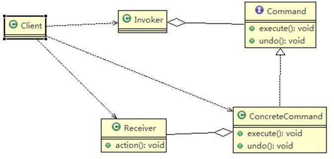
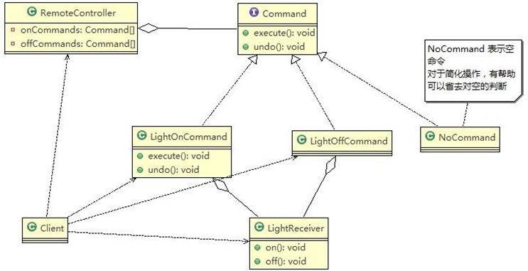

```java
package command;

public class LightOnCommand implements Command {

    //聚合LightReceiver
    LightReceiver lightReceiver;

    public LightOnCommand(LightReceiver lightReceiver) {
        this.lightReceiver = lightReceiver;
    }

    @Override
    public void execute() {
        //调用接收者的方法
        lightReceiver.on();
    }

    @Override
    public void undo() {
        //调用接收者的方法
        lightReceiver.off();
    }
}

```
```java
package command;

public class RemoteController {
    //开 按钮的命令数组
    Command[] onCommands;
    Command[] offCommands;

    //执行撤销的命令
    Command undoCommand;

    //构造器 完成对按钮的初始化

    public RemoteController() {
        onCommands = new Command[5];
        offCommands = new Command[5];
        for (int i = 0; i < 5; i++) {
            onCommands[i] = new NoCommand();
            offCommands[i] = new NoCommand();
        }
    }

    //给我们的按钮设置你需要的命令
    public void setCommand(int no,Command onCommand,Command offCommand){
        onCommands[no] = onCommand;
        offCommands[no] = offCommand;
    }

    //按下开按钮
    public void onButtonWasPushed(int no){
        //找到你按下的开的按钮，并调用对应方法
        onCommands[no].execute();
        //记录这次的操作，用于撤销
        undoCommand = onCommands[no];
    }

    //按下关按钮
    public void offButtonWasPushed(int no){
        //找到你按下的关的按钮，并调用对应方法
        offCommands[no].execute();
        //记录这次的操作，用于撤销
        undoCommand = offCommands[no];
    }

    //按下撤销按钮
    public void undoButtonWasPushed(){
        undoCommand.undo();
    }
}

```

