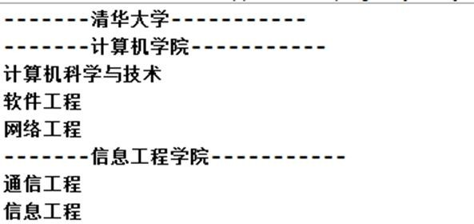
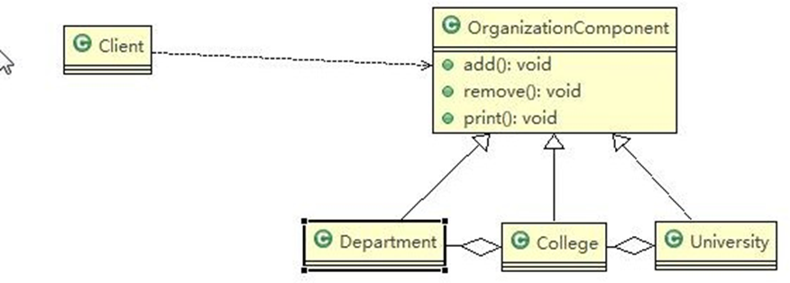

```html
12.8	组合模式的注意事项和细节

1)	简化客户端操作。客户端只需要面对一致的对象而不用考虑整体部分或者节点叶子的问题。
2)	具有较强的扩展性。当我们要更改组合对象时，我们只需要调整内部的层次关系，客户端不用做出任何改动.
3)	方便创建出复杂的层次结构。客户端不用理会组合里面的组成细节，容易添加节点或者叶子从而创建出复杂的树形结构
4)	需要遍历组织机构，或者处理的对象具有树形结构时, 非常适合使用组合模式.
5)	要求较高的抽象性，如果节点和叶子有很多差异性的话，比如很多方法和属性都不一样，不适合使用组合模式

```
```java
package composite;

public abstract class OrganizationComponent {
    private String name;//名字
    private String des;//说明

    protected void add(OrganizationComponent organizationComponent){
        //默认实现
        throw new UnsupportedOperationException();
    }

    protected void remove(OrganizationComponent organizationComponent){
        //默认实现
        throw new UnsupportedOperationException();
    }

    public OrganizationComponent(String name, String des) {
        this.name = name;
        this.des = des;
    }

    public String getName() {
        return name;
    }

    public void setName(String name) {
        this.name = name;
    }

    public String getDes() {
        return des;
    }

    public void setDes(String des) {
        this.des = des;
    }

    //打印方法print 做成抽象的 子类
    protected abstract void print();
}


```

