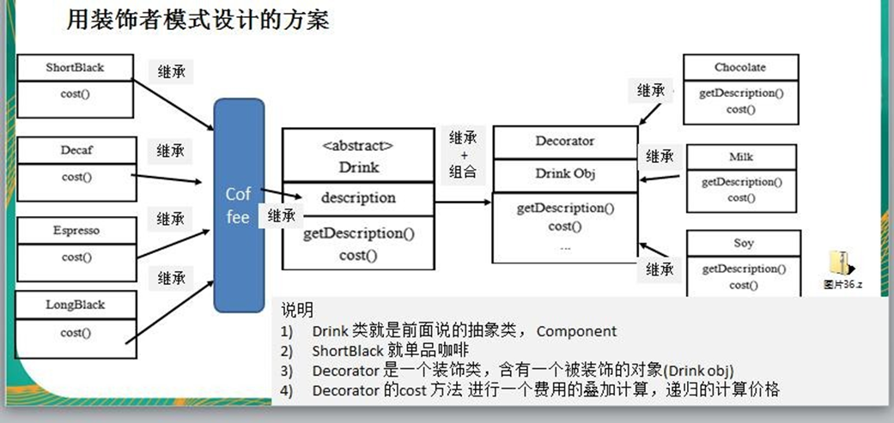
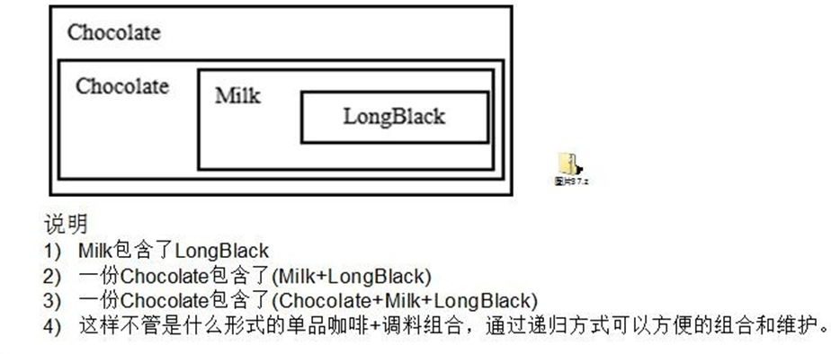

```java
package decorator;

/**
 * Description : 装饰器
 * Created on : 2021-06-14
 * author : renzhi.zuo
 */

public class Client {
    public static void main(String[] args) {
        // TODO Auto-generated method stub

        Drink order = new LongBlack();

        order = new Milk(order);

        order = new Soy(order);

        System.out.println(order.cost());
        System.out.println(order.getDes());


    }
}


```

