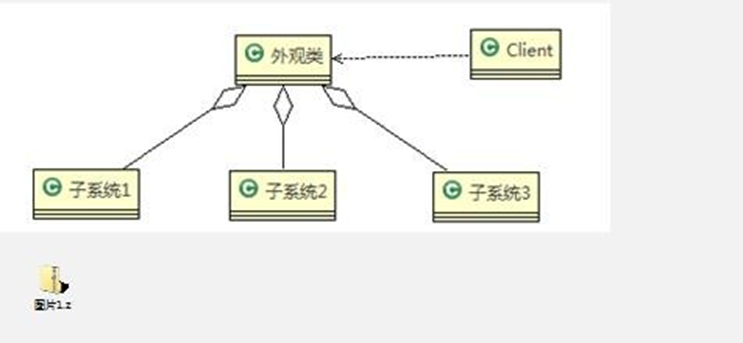
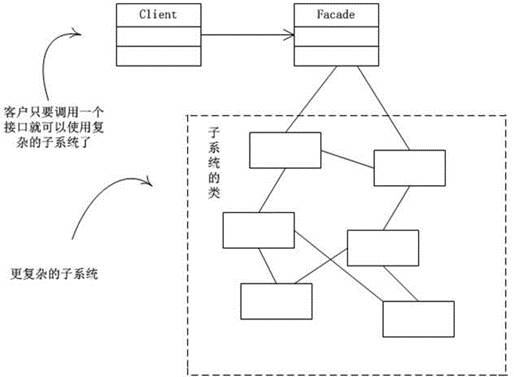
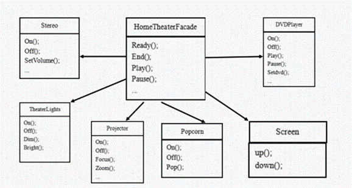

```java
package facade;

//外观模式
public class Client {
    public static void main(String[] args) {
        HomeTheaterFacade homeTheaterFacade = new HomeTheaterFacade();
        homeTheaterFacade.ready();
        homeTheaterFacade.play();
        homeTheaterFacade.pause();
        homeTheaterFacade.end();
    }
}


```


