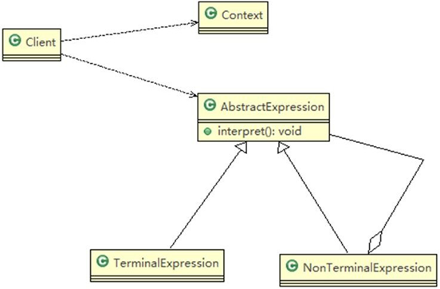
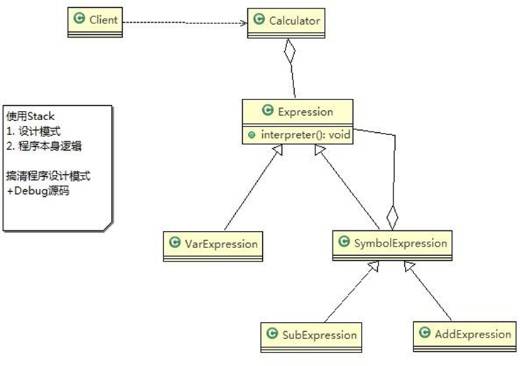

```html
23.4	解释器模式的原理类图

	对原理类图的说明-即(解释器模式的角色及职责)
1)	Context: 是环境角色,含有解释器之外的全局信息.
2)	AbstractExpression: 抽象表达式， 声明一个抽象的解释操作,这个方法为抽象语法树中所有的节点所共享
3)	TerminalExpression: 为终结符表达式, 实现与文法中的终结符相关的解释操作
4)	NonTermialExpression: 为非终结符表达式，为文法中的非终结符实现解释操作.
5)	说明： 输入 Context he TerminalExpression  信息通过 Client 输入即可

```
```java
package interpreter;

import java.io.BufferedReader;
import java.io.IOException;
import java.io.InputStreamReader;
import java.util.HashMap;

//解释器模式
public class ClientTest {

    public static void main(String[] args) throws IOException {
        // TODO Auto-generated method stub
        String expStr = getExpStr(); // a+b
        HashMap<String, Integer> var = getValue(expStr);// var {a=10, b=20}
        Calculator calculator = new Calculator(expStr);
        System.out.println("运算结果：" + expStr + "=" + calculator.run(var));
    }

    // 获得表达式
    public static String getExpStr() throws IOException {
        System.out.print("请输入表达式：");
        return (new BufferedReader(new InputStreamReader(System.in))).readLine();
    }

    // 获得值映射
    public static HashMap<String, Integer> getValue(String expStr) throws IOException {
        HashMap<String, Integer> map = new HashMap<>();

        for (char ch : expStr.toCharArray()) {
            if (ch != '+' && ch != '-') {
                if (!map.containsKey(String.valueOf(ch))) {
                    System.out.print("请输入" + String.valueOf(ch) + "的值：");
                    String in = (new BufferedReader(new InputStreamReader(System.in))).readLine();
                    map.put(String.valueOf(ch), Integer.valueOf(in));
                }
            }
        }

        return map;
    }
}


```

