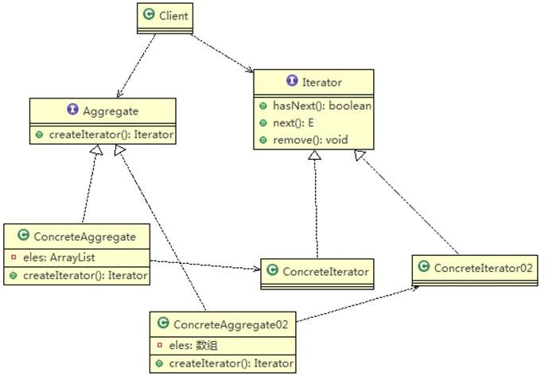
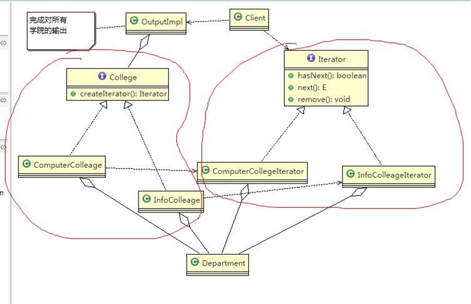

```java
package iterator;

import java.util.ArrayList;
import java.util.List;

//迭代器模式
public class Client {
    public static void main(String[] args) {
        //创建学院
        List<College> collegeList = new ArrayList<>();

        ComputerCollege computerCollege = new ComputerCollege();
        InfoCollege infoCollege = new InfoCollege();

        collegeList.add(computerCollege);
        collegeList.add(infoCollege);

        OutPutImpl outPut = new OutPutImpl(collegeList);
        outPut.printCollege();

    }
}


```

