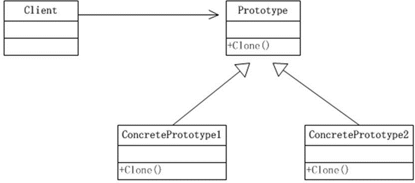

```html
7.10	原型模式的注意事项和细节

1)	创建新的对象比较复杂时，可以利用原型模式简化对象的创建过程，同时也能够提高效率
2)	不用重新初始化对象，而是动态地获得对象运行时的状态
3)	如果原始对象发生变化(增加或者减少属性)，其它克隆对象的也会发生相应的变化，无需修改代码
4)	在实现深克隆的时候可能需要比较复杂的代码
5)	缺点：需要为每一个类配备一个克隆方法，这对全新的类来说不是很难，但对已有的类进行改造时，需要修改其源代码，违背了 ocp 原则，这点请同学们注意.

```
```java
package prototype.deepclone;

import java.io.*;

public class DeepProtoType implements Serializable,Cloneable {
    public String name;
    public DeepCloneableTarget deepCloneableTarget;  //引用类型

    public DeepProtoType() { }

    //深拷贝  方式一 使用clone方法
    @Override
    protected Object clone() throws CloneNotSupportedException {
        Object deep = null;
        //这里完成的是对基本数据类型（属性）和string的克隆
        deep = super.clone();
        //对应用类型的属性进行单独处理
        DeepProtoType deepProtoType = (DeepProtoType)deep;
        deepProtoType.deepCloneableTarget = (DeepCloneableTarget) deepCloneableTarget.clone();
        return deepProtoType;
    }

    //深拷贝 - 方式2 通过对象的序列化实现深拷贝
    public Object deepClone(){
        //创建流对象
        ByteArrayOutputStream bos = null;
        ObjectOutputStream oos = null;
        ByteArrayInputStream bis = null;
        ObjectInputStream ois = null;

        try {
            //序列化操作
            bos = new ByteArrayOutputStream();
            oos = new ObjectOutputStream(bos);
            oos.writeObject(this);//当前这个对象以对象流的方式输出

            //反序列化
            bis = new ByteArrayInputStream(bos.toByteArray());
            ois = new ObjectInputStream(bis);
            DeepProtoType deepProtoType = (DeepProtoType) ois.readObject();
            return deepProtoType;
        }catch (Exception e){
            e.printStackTrace();
            return null;
        }finally {
            //关闭流
            try {
                bos.close();
                oos.close();
                bis.close();
                ois.close();
            }catch (Exception e){
                System.out.println(e.getMessage());
            }
        }
    }

}


```
