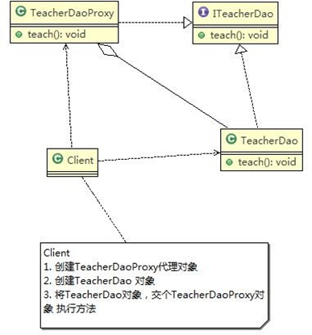
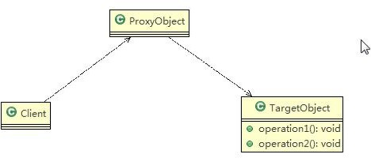
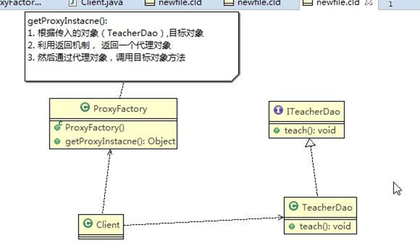
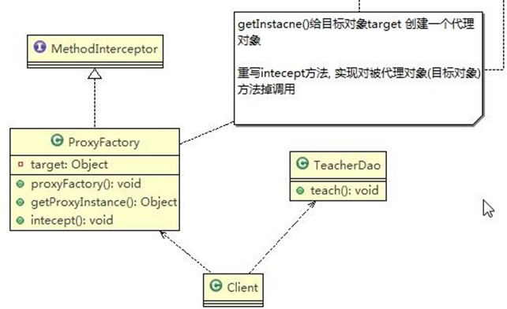

```java
package proxy.dynamic;

import java.lang.reflect.InvocationHandler;
import java.lang.reflect.Method;
import java.lang.reflect.Proxy;

public class ProxyFactory {
    //维护一个目标对象 object
    private Object target;

    //构造器 对target进行初始化
    public ProxyFactory(Object target){
        this.target = target;
    }

    //给目标对象 生成一个代理对象
    public Object getProxyInstance(){
        /*
         * 说明
         * public static Object newProxyInstance(ClassLoader loader,
         *                                  Class<?>[] interfaces,
         *                                  InvocationHandler h)
         * 1、ClassLoader loader ：指定当前目标对象使用的类加载器，获取加载器的方法固定
         * 2、Class<?>[] interfaces ： 目标对象实现的接口类型 使用泛型方法确认类型
         * 3、InvocationHandler h ： 事情处理，执行目标对象的方法时，会出发事情处理方法，
         *    会把当前执行的目标对象方法作为参数传入
         *
         * */
        return Proxy.newProxyInstance(
                target.getClass().getClassLoader(),
                target.getClass().getInterfaces(),
                new InvocationHandler() {
                    @Override
                    public Object invoke(Object proxy, Method method, Object[] args) throws Throwable {
                        System.out.println("jdk代理开始。。。。");
                        Object invoke = method.invoke(target, args);
                        System.out.println("jdk代理提交。。。");
                        return invoke;
                    }
                }
        );

    }

}


```
```java
package proxy.dynamic;

//动态代理
public class Client {
    public static void main(String[] args) {
        //创建目标对象
        ITeacherDao target = new TeacerDao();

        //给目标对象创建代理对象，可以转成ITeacherDao
        ITeacherDao proxyInstance = (ITeacherDao) new ProxyFactory(target).getProxyInstance();

        //proxuInstance=class com.sun.proxy.$Proxy0  内存中动态生成了代理对象
        System.out.println("proxuInstance=" + proxyInstance.getClass());

        //通过代理对象 调用 目标对象的方法
        proxyInstance.teach();

        proxyInstance.sayHello("wzc");
    }
}

```
```html
15.5	几种常见的代理模式介绍— 几种变体
1)	防火墙代理
内网通过代理穿透防火墙，实现对公网的访问。
2)	缓存代理
比如：当请求图片文件等资源时，先到缓存代理取，如果取到资源则 ok,如果取不到资源，再到公网或者数据库取，然后缓存。

3)	远程代理
远程对象的本地代表，通过它可以把远程对象当本地对象来调用。远程代理通过网络和真正的远程对象沟通信息。
4)	同步代理：主要使用在多线程编程中，完成多线程间同步工作同步代理：主要使用在多线程编程中，完成多线程间同步工作

```



