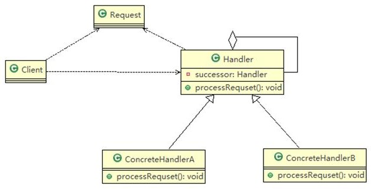
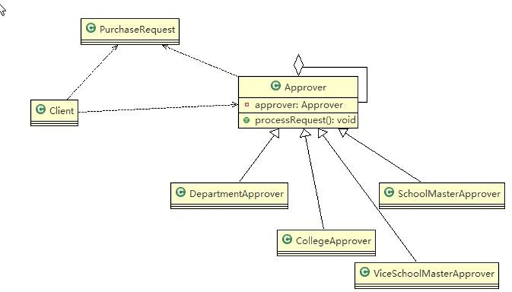

```java
package responsibilitychain;

//职责链模式
public class Client {
    public static void main(String[] args) {
        //创建爱一个请求
        PurchaseRequest purchaseRequest = new PurchaseRequest(1, 500, 1);

        //创建相关的审批人
        DepartmentApprover departmentApprover = new DepartmentApprover("张主任");
        CollegeApprover collegeApprover = new CollegeApprover("李院长");
        ViceSchoolMasterApprover viceSchoolMasterApprover = new ViceSchoolMasterApprover("赵副校长");
        ScoolMasterApprover scoolMasterApprover = new ScoolMasterApprover("王校长");

        //需要将各个审批级别的下一个设置好(处理人构成环状)
        departmentApprover.setApprover(collegeApprover);
        collegeApprover.setApprover(viceSchoolMasterApprover);
        viceSchoolMasterApprover.setApprover(scoolMasterApprover);
        scoolMasterApprover.setApprover(departmentApprover);

        scoolMasterApprover.processRequset(purchaseRequest);


    }
}


```

