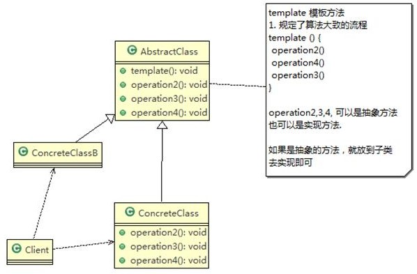
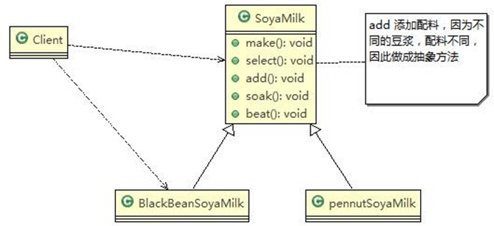

```java
package template.improve;

//模板方法模式的钩子方法
public class Client {
    public static void main(String[] args) {
        //制作红豆豆浆
        System.out.println("----制作红豆豆浆----");
        RedBeanSoyaMilk redBeanSoyaMilk = new RedBeanSoyaMilk();
        redBeanSoyaMilk.make();

        //制作花生豆浆
        System.out.println("----制作花生豆浆----");
        PeanutSoyaMilk peanutSoyaMilk = new PeanutSoyaMilk();
        peanutSoyaMilk.make();

        //制作纯豆浆
        System.out.println("----制作纯豆浆----");
        PureSoyaMilk pureSoyaMilk = new PureSoyaMilk();
        pureSoyaMilk.make();
    }
}


```
```java
package template.improve;

//抽象类  表示豆浆
public abstract class SoyaMilk {

    //模板方法 make 模板方法可以做成final  不让子类去覆盖
    final void make(){
        select();
        if (customerWantCondiments()) {
            addCondiments();
        }
        soak();
        beat();
    }

    //选材料
    void select(){
        System.out.println("第一步：选择好的新鲜黄豆");
    }

    //添加不同的配料，抽象方法，子类具体实现
    abstract void addCondiments();

    //浸泡
    void soak(){
        System.out.println("第三步：黄豆和配料开始浸泡,三小时");
    }

    void beat(){
        System.out.println("第四步：黄豆和配料放到豆浆机中打碎");
    }

    //钩子方法，决定是否需要添加配料
    //钩子方法：在模板方法的父类中，定义一个方法，默认不做任何事，子类可以视情况要不要覆盖他
    boolean customerWantCondiments(){
        return true;
    }
}

```

