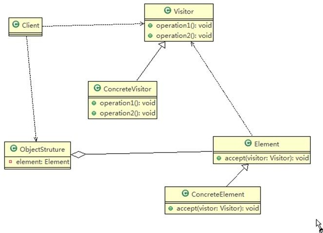
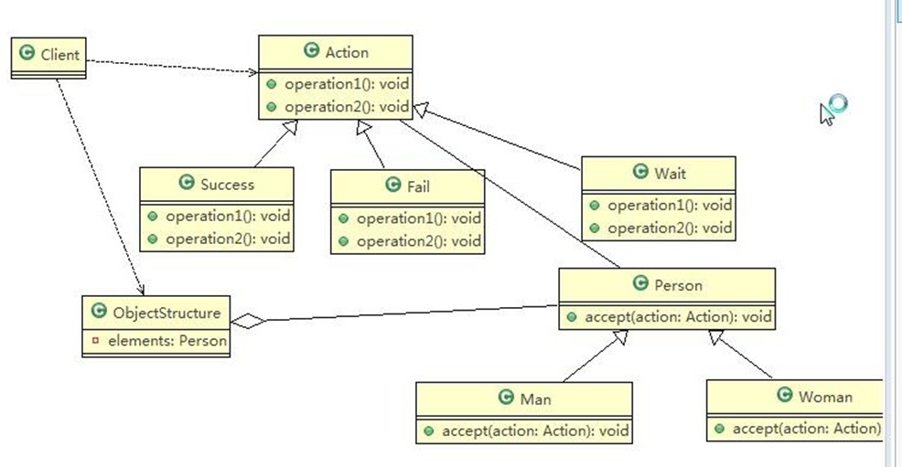

```java
package visitor;

/**
 * 访问者
 */
public class Client {
    public static void main(String[] args) {
        //创建OnjectStructure
        ObjectStructure objectStructure = new ObjectStructure();

        objectStructure.attach(new Man());
        objectStructure.attach(new Woman());

        //成功
        Success success = new Success();
        objectStructure.display(success);

        //失败
        Fail fail = new Fail();
        objectStructure.display(fail);

        //待定
        Wait wait = new Wait();
        objectStructure.display(wait);
    }
}


```
```java
package visitor;

/**
 * 说明
 *  1、这里使用到双分派，即首先在客户端程序中，
 *      将具体状态作为参数传递Woman中（第一次分派）
 *  2、然后Woman 类用作参数的 具体方法 中方法getWomanRestlt，
 *      同时将自己 this作为参数传入，完成第二次分派
 */
public class Woman extends Person {
    @Override
    public void accept(Action action) {
        action.getWomanRestlt(this);
    }
}

```

